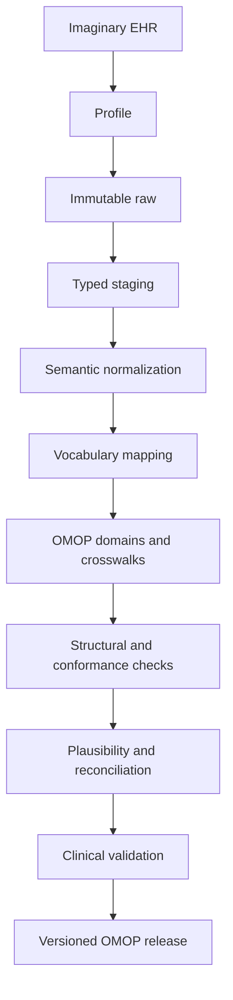

# Transformation Lifecycle Diagram

```mermaid
flowchart TD
    A[Imaginary EHR] --> B[Profile]
    B --> C[Immutable raw]
    C --> D[Typed staging]
    D --> E[Semantic normalization]
    E --> F[Vocabulary mapping]
    F --> G[OMOP domains and crosswalks]
    G --> H[Structural and conformance checks]
    H --> I[Plausibility and reconciliation]
    I --> J[Clinical validation]
    J --> K[Versioned OMOP release]
```

Plain-text equivalent: source → profiling → raw → staging → normalization → mapping → OMOP → quality → clinical review → release.
